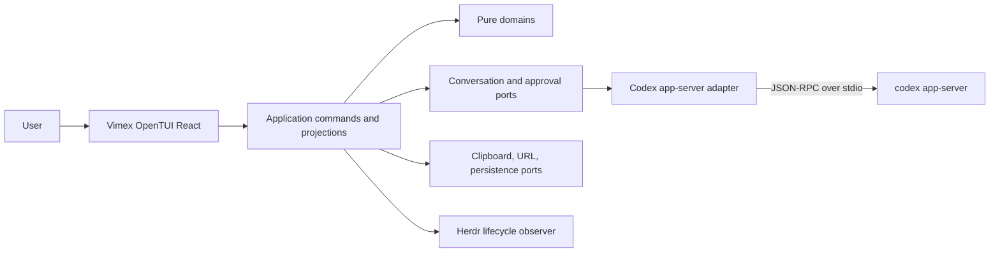

# Vimex v1 Architecture

## Scope

Codex app server owns the agent runtime. Vimex owns the interactive client.

Vimex does not implement model orchestration, sandbox execution, tool execution, approvals policy, or canonical thread persistence. It does implement a durable local projection suited to a full-screen Vim interface: transcript positions, viewport anchors, folds, selections, drafts, focus, and command routing.

## Runtime topology



The CLI starts the TUI and, by default, spawns `codex app-server`. Transport is replaceable so an existing or future remote app-server connection does not affect domain code.

## Bounded contexts

### Conversation

Owns threads, turns, conversation items, streaming lifecycles, parent-child relationships, and normalized agent state. Codex is its external source of truth.

### Transcript

Projects a conversation into an interactive logical document. It owns nodes, stable logical positions, cursor, selection, URL targets, Markdown source mappings, folds, viewport anchors, and unseen-output state. It also defines the renderer-neutral transcript runtime, immutable presentation frames, damage vocabulary, and window-planning contracts.

### Composer

Owns per-thread drafts, editing buffer state, pending submissions, and steer-versus-next-turn intent.

### Interaction

Owns the Vim state machine, motions, operators, counts, key sequences, focus, command parsing, and dispatch. It expresses intent through application commands and has no rendering dependency.

### Approvals

Owns pending server requests, correlation identifiers, decisions, and presentation-ready summaries. The Codex adapter resolves the actual server request.

### Workbench

Combines active-thread and workspace facts into presentation selectors: thread name, model, reasoning effort, context usage, cwd, branch, connection state, approvals, and unseen output. It settles streaming ingress and retains one transcript-runtime instance for each stable presentation identity.

## Data flow

Inbound events follow one path:

```text
Codex notification
  -> wire decoder
  -> versioned wire-to-domain mapper
  -> ConversationEvent or ApprovalRequest
  -> bounded conversation ingress
  -> domain reducer
  -> transcript/workbench projection
  -> per-presentation TranscriptRuntime
  -> immutable TranscriptFrame
  -> OpenTUI React renderer
```

Input follows the reverse path:

```text
OpenTUI key event
  -> @opentui/keymap layer
  -> named Vim command
  -> interaction state machine
  -> transcript/composer/conversation application command
  -> port
  -> Codex or platform adapter
```

React components do not interpret Codex notifications and do not call JSON-RPC directly.

## State ownership

| State | Owner | Persistence |
|---|---|---|
| Threads, turns, items, active turn | Conversation | Codex canonical; normalized local mirror |
| Cursor, anchor, selection, folds | Transcript | Per-thread local state |
| Displayed revision, damage, render window, block estimates | Per-presentation TranscriptRuntime, retained by Workbench | Process-local, recoverable cache |
| Native cells and renderable measurements | OpenTUI adapter | Process-local, disposable |
| Draft and pending submission | Composer | Per-thread local persistence |
| Vim mode and focus | Interaction | Process-local |
| Pending approval requests | Approvals | Process-local, correlated by request ID |
| Model, effort, cwd, token usage | Workbench projection | Derived from Codex state |
| Git branch | Workbench projection | Codex thread Git info, with adapter refresh if required |
| Theme and key overrides | UI settings | Local persistence |
| Herdr pane metadata | Herdr adapter | Reported outward, never canonical |

There is no undifferentiated global state object. A store implementation may host several domain slices, but ownership and mutation remain explicit.

## Logical transcript model

Screen rows are ephemeral. Transcript positions must refer to stable logical identities:

```ts
type LogicalPosition = {
  itemId: ItemId
  blockId: BlockId
  graphemeOffset: number
}

type ViewportAnchor =
  | { type: "tail" }
  | { type: "position"; position: LogicalPosition; screenRow: number }
```

The transcript keeps canonical Markdown and a source map between rendered blocks and source spans. This supports rendered-text copy, Markdown copy, URL resolution, search, reflow, and stable Visual selections.

`item/completed` or its current protocol equivalent is authoritative. Deltas update provisional state; completion replaces or reconciles it.

## Ports

Application packages declare ports resembling:

```ts
interface ConversationGateway {
  startThread(input: StartThread): Promise<ThreadId>
  resumeThread(id: ThreadId): Promise<void>
  forkThread(input: ForkThread): Promise<ThreadId>
  startTurn(input: StartTurn): Promise<TurnId>
  steerTurn(input: SteerTurn): Promise<void>
  interruptTurn(threadId: ThreadId): Promise<void>
  events(): AsyncIterable<ConversationEvent>
}

interface Clipboard {
  writeText(value: string): Promise<void>
}

interface UrlOpener {
  open(target: URL): Promise<void>
}

interface LifecycleObserver {
  report(snapshot: LifecycleSnapshot): Promise<void>
}
```

Adapters implement ports; domains do not import adapter types.

## Codex compatibility boundary

Generated app-server TypeScript artifacts are specific to an installed Codex version. They live unchanged in a versioned generated directory. Handwritten mapping code translates every known wire variant into stable domain events.

Compatibility policy:

- Pin and record the schema-generation Codex version.
- Contract-test mappers with recorded fixtures.
- Map unknown notifications and items to explicit unknown variants.
- Log protocol version and capability negotiation at startup.
- Keep stdio framing, request correlation, reconnection, and cancellation in the adapter.

## Rendering boundary

`ui-opentui-react` owns React and OpenTUI details. It uses OpenTUI Markdown, diff, textarea, scrollbox, clipboard, and keymap integrations but does not expose those types to domains.

The UI subscribes to narrow selectors and cached immutable transcript frames. Streaming a message should update the affected render blocks rather than rerendering unrelated history. Viewport culling must not make application state depend on render hooks.

OpenTUI measures native renderables and reports renderer-neutral block measurements to the transcript runtime. Measurement feedback may refine disposable presentation geometry, but it never owns canonical content, semantic positions, follow state, or displayed revision identity.

## Herdr boundary

Herdr integrates through lifecycle and external-action ports. The initial plugin reports pane state, Codex thread identity, and workbench metadata. It may intercept URL opening or launch behavior. It does not access internal stores or generated Codex types.

Vimex remains runnable outside Herdr, which keeps terminal testing and development simple and isolates Herdr API volatility.

## Failure handling

- App-server exit changes the connection state and preserves drafts and local view state.
- Malformed and unknown events are surfaced diagnostically without terminating the renderer.
- Rendering errors are contained by item-level and application-level error boundaries.
- Shutdown restores alternate-screen, cursor, mouse, and raw-mode state.
- Pending approval requests become invalid when their transport connection is lost and must not be replayed blindly.

## Extension policy

V1 uses internal extension points for lifecycle observers, named commands, status segments, transcript renderers, external actions, and themes. A public plugin ABI is deferred until transcript and Vim semantics stabilize.


## Transcript runtime, geometry, and scrolling

[Transcript runtime](./transcript-runtime.md) is the specialized normative design for this subsystem. [The implementation ledger](./transcript-runtime-implementation.md) records its staged migration and evidence.

The transcript domain owns logical cursor, selection, and viewport anchors independently. `viewport.anchor` changes the reading anchor without moving the cursor or selection. The workbench forwards this intent without depending on terminal APIs.

The target architecture retains one renderer-neutral `TranscriptRuntime` per stable presentation identity. The runtime owns displayed revision, follow or detached mode, damage, block-local measurement knowledge, and window planning. Workbench owns each runtime's lifetime; a thin React bridge subscribes to its cached frames. OpenTUI owns native measurement and rendering only.

Before this migration is complete, `transcript/use-transcript-layout.ts` coordinates measurement scheduling, thread-specific geometry, explicit tail attachment, and anchor restoration, while `rendered-layout.ts` owns native measurement and invalidation. This is the current implementation rather than a second target authority. Stage 2 introduces the pass-through runtime; Stage 3 moves measurement extraction behind the OpenTUI adapter and removes or reduces the displaced legacy responsibility in the same vertical slice.

Scroll-only changes reuse immutable block-local geometry with a screen translation; content, fold, and width changes produce explicit damage. Cursor movement uses row indexes rather than flattening all text points for each keypress. Unknown revision relationships fall back to a full presentation rebuild.

Mouse-wheel deltas remain linear and detach native following immediately. Keyboard page jumps remain immediate; neither path introduces an animation timer. Only explicit tail attachment resumes following output. Native scroll state must not override the semantic viewport contract at the bottom edge.

These are in-process feature modules, not new services or package boundaries. Native rendering remains renderer-owned; logical navigation and renderer-neutral presentation policy remain in the transcript package. Large cold reflows and complete end-to-end latency require separate profiling from warm scroll benchmarks.


Diff geometry is an OpenTUI adapter concern. Canonical server patches remain in conversation records; native split columns and line-number gutters do not redefine transcript source order. Native layout integration depends on pinned OpenTUI internals and has renderer regression coverage; upgrades must revalidate those assumptions. Large-history initial Markdown settlement remains a known cold-path performance cost even though warm scroll translations reuse geometry.


During migration, existing item-local fingerprints continue to track semantic projection, fold state, content, wrapping, and local child layout. The target cache is render-block-local and keyed by stable block identity, content revision, width, style revision, and fold state. A fold or changed live block reuses unaffected geometry without mutating prior frames. Whole-viewport scroll translation remains the fastest path. Estimated layout is a recoverable fallback until native measurement is available.
